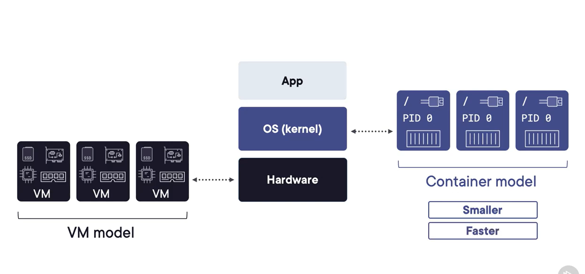

# Getting Started with Docker

Official repo for Getting Started with Docker video training course by [@nigelpoulton](https://twitter.com/nigelpoulton).

Cloned by `@thoriqmacto` on 2023.08.20

## first-container

This folder contains the files to build a single-container web app (express, handlebars...)

- Docker hub image: [nigelpoulton/gsd:first-ctr](https://hub.docker.com/repository/docker/nigelpoulton/gsd)

## multi-container

NEEDS UPDATING
This folder contains the files to build a multi-container web app with Compose.

- Pthon flask app with redis cache
- Docker hub image: [nigelpoulton/gsd:compose-app](https://hub.docker.com/repository/docker/nigelpoulton/gsd)

## swarm-stack

This folder contains the files to build a multi-container web app with Swarm Stacks.

- Pthon flask app with redis cache that also returns hostname of container servicing request
- Docker hub image: [nigelpoulton/gsd:swarm-stack](https://hub.docker.com/repository/docker/nigelpoulton/gsd)

## TMP

The `container`, `compose`, and `swarm` folders are hosting temp files for the next update to the course.

## Self-note

A good recap from the course on Part-3 "Deploying a Containerized App" which highlighted where docker positions in virtualization world.
See below snapshot.

